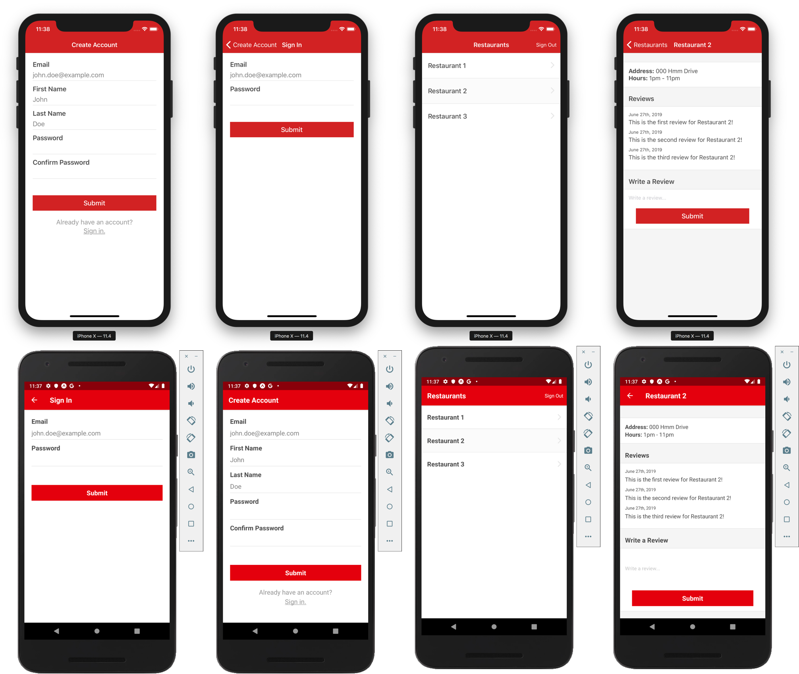

## React Native Review App

A simple cross platform (iOS and Android) React Native review app and server (powered by now.sh) that has authentication integrated. This example was put together for [React Native by Example](https://www.reactnativebyexample.com/). Get started learning & mastering React Native for free!

### Installation

- `git clone https://github.com/ReactNativeSchool/react-native-review-app.git`
- `cd mobile`
- `yarn install`/`npm install`
- `cd server`
- `yarn install`/`npm install`

### Running Mobile

- `cd mobile`
- `yarn run ios`/`npm run ios` or `yarn run android`/`npm run android`

### Running Server

- `cd server`
- `now dev`

---

This project was put together to serve as an example to help you in building your own React Native apps. Feel free to download it and tinker with it!

